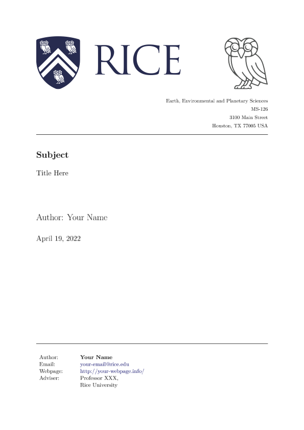

# Latex Template Rice USTC

[](https://github.com/OUCyf/Latex-Template-Rice-USTC/actions/workflows/build.yml)

Please feel free to use this template for your reports.

## Download

Click `Use this template`, and then git clone in your repo.

```bash
$ git clone git@github.com:OUCyf/Latex-Template-Rice-USTC.git
```

Download template PDF:
 


- [main.pdf](https://github.com/OUCyf/Latex-Template-Rice-USTC/raw/gh-pages/main.pdf)




---

<object data="https://github.com/OUCyf/Latex-Template-Rice-USTC/raw/gh-pages/main.pdf" width="1000" height="1000" type='application/pdf'></object>

<!-- 
[embed]https://github.com/OUCyf/Latex-Template-Rice-USTC/raw/gh-pages/main.pdf[/embed]

<object data="https://github.com/OUCyf/Latex-Template-Rice-USTC/raw/gh-pages/main.pdf" type="application/pdf" width="700px" height="700px">
    <embed src="https://github.com/OUCyf/Latex-Template-Rice-USTC/raw/gh-pages/main.pdf">
        <p>This browser does not support PDFs. Please download the PDF to view it: <a href="https://github.com/OUCyf/Latex-Template-Rice-USTC/raw/gh-pages/main.pdf">Download PDF</a>.</p>
    </embed>
</object> 
-->

---

## Build

To build the template, you need to have **LaTeX** installed. The full LaTeX distribution (e.g., [TeXLive](https://www.tug.org/texlive/) on Linux or [MacTeX](https://www.tug.org/mactex/) on macOS)(>5 GB) are recommended in this template. Install LaTeX via [TexLive](https://github.com/scottkosty/install-tl-ubuntu), and via [MacTex](https://www.tug.org/mactex/).

We also used `minted` latex package to highlight code, which depended on the [Pygments](https://pygments.org/) (a python package) installed firstly

1. Install Pygments:

```bash
$ pip install Pygments
```

2. Build via Makefile:

```bash
$ make
```

3. Build via VSCode:

   Please check `latex-workshop.latex.tools` and `latex-workshop.latex.recipes` options in `.vscode/settings.json` file.


## Directory structure

    .
    ├── ...
    ├── jl                      # Julia framework script files
    ├── tex                     # LaTeX files (main and preamble files)
    │   └── slides              # LaTeX files (specifically for slides)
    └── output                  # Generated output file (.aux files, etc)

## Acknowledgemnt

The template refer to [Karolinska Institutet](https://www.overleaf.com/latex/templates/thesis-template-masters-health-informatics-ki-su/dpyvvsqhygng).
